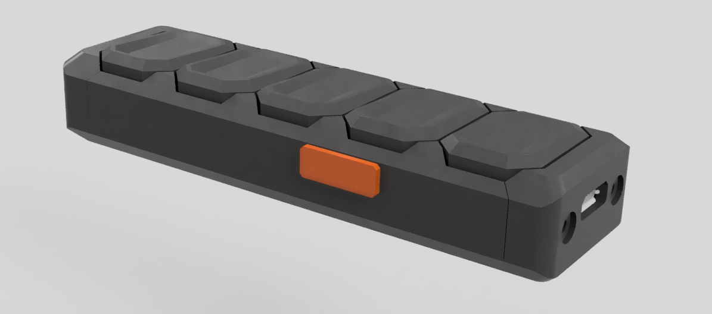

# ESPRemote
### VER 0.1

A simple WiFI remote controller using the ESP8266 SoC.

The goal of this project is the creation of a simple to use WiFi remote controller aimed at usage with the numerous home automation suites available, such as _[HomeAssistant](https://www.home-assistant.io)_ and _[OpenHab](https://www.openhab.org)_.

The system utilizes an _[Espressif ESP-12](https://docs.platformio.org/en/latest/boards/espressif8266/esp12e.html)_ module coupled with an _[MCP73831T](https://www.google.gr/url?sa=t&rct=j&q=&esrc=s&source=web&cd=1&ved=2ahUKEwiDvMTDpvbgAhXJfFAKHZEMD0UQFjAAegQIChAC&url=https%3A%2F%2Fwww.sparkfun.com%2Fdatasheets%2FPrototyping%2FBatteries%2FMCP73831T.pdf&usg=AOvVaw3YKAY2DJq01YtSUwFzsNai)_ chip for battery management and an _[AP2112K](https://www.google.gr/url?sa=t&rct=j&q=&esrc=s&source=web&cd=1&ved=2ahUKEwjnxLrnpvbgAhUEK1AKHWMBD-AQFjAAegQIChAC&url=https%3A%2F%2Fwww.diodes.com%2Fassets%2FDatasheets%2FAP2112.pdf&usg=AOvVaw2XV2W1VE0JfD3LlF0lkARI)_ LDO voltage regulator.

## Configurations

The board can be configured as a battery powered remote control, or as a DC powered button panel. To achieve this a jumper was added (SJ2) to select between battery and direct USB power. A second jumper was also added (JP2) to bypass the power switch. Using the above jumpers, the BMS circuit can be completely ignored and left unpopulated in case the device is inteded for always pluged-in use from a 5V DC power supply.

## Firmware

Using the _[Espressif ESP-12](https://docs.platformio.org/en/latest/boards/espressif8266/esp12e.html)_ module offers great flexibility in existing firmware options. For now the board is usign the _[ESPHome](https://esphome.io/index.html)_ firmware designed for seemless intergation with the _[HomeAssistant](https://www.home-assistant.io)_ platform.

Due to the device not beign intended as a development board, an FTDI chip was excluded from the design, leaving the need for a small 6-pin SH 1.0mm micro jst connector as a UART interface.

**Uploading new firmware requires the pin D0 and GND of the UART connector to be tied together.** After doing so the device must be reset, setting it in download mode and enabling new firmware to be uploaded. **This can also be achieved holding down the 4th button before powering on the device**.

## I/O

|                              | Pin         |
|---------------------------|--------------|
| Button 1              | GPIO5   |
| Button 2              | GPIO4   |
| Button 3              | GPIO12 |
| Button 4              | GPIO0   |
| Button 5              | GPIO13 |
| Battery Voltage  | ADC      |
| Status Led          | GPIO16 |

## PCB

## Enclosure

The enclosure is designed to incorporate 2x 250mAh li-po cells and be 3D printed in two parts.

## Future Work

- Incorporate a small 128x64 OLED screen.
- Add an IR transmitter to the design, so that the controller can be used with existing household devices.
- Add an accelerometer for gesture control.
- Design a better, prettier and easier to hold enclosure.